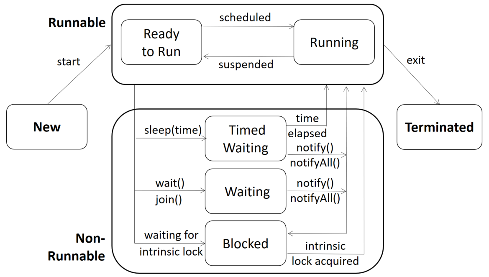

# CISC/CMPE 422: Formal Methods in Software Engineering
## Illustration of multithreading in Java, thread safety, and race conditions

### Multi-threading

_Multi-threading_ allows the joint, concurrent execution of two or more parts of a program. 
Each part is called a _thread_. Java supports multi-threading via its `Thread` class and 
`Runnable` interface. The purpose of multi-threading typically is to leverage the presence 
of multiple cores or CPUs to increase performance and utilization.

Threads often share data (memory) which they access via shared variables. 
All programs in this repo illustrate this. 
The _thread scheduler_ is a part of the Java runtime system which
decides when a thread is run. By default, the scheduler obeys
some built-in restrictions about when it stops the execution of
one thread and starts or resumes the execution of another. 
For instance, assignments are _atomic_ (i.e., uninterruptable by the 
scheduler), unless the variable assigned to has type `long` or `double`.

### Race conditions
Typically, these built-in restrictions are insufficient to ensure
proper access to the shared data and correct executions. 
Programs [<tt>RaceConditionOnIntVar.java</tt>](src/main/java/RaceConditionOnIntVar.java) 
and [<tt>RaceConditionOnLongVar.java</tt>](src/main/java/RaceConditionOnLongVar.java)
illustrate 
this situation. Apart from the built-in restriction that assignments
to variables of type int are atomic, no additional 
restrictions on the access to the shared variable `x` are imposed. 
In both programs, `x` is initialized to 0 and then two threads perform
a specific number of increments (`NUM_INCREMENTS`) on `x`. 
Our expectation is that `x` has value `2*NUM_INCREMENTS` upon program 
termination. However, in both programs it is possible that the
scheduler interrupts a thread during the execution of an increment:
more precisely, right after the current value of `x` has been read, and
before the incremented value is written back into `x`. In this case, 
increments can 'get lost' and `x` ends up with a value less than
expected.

Since the behaviour of the scheduler may change from
one invocation to the next, if and when these race conditions occur
is not predictable making it possible the programs exhibit 
_non-deterministic behaviour_, i.e., repeated invocations
can cause different executions each of which leaves `x` with 
a different final value.

Thread schedules causing bugs are called _race conditions_.
Multi-threaded programs with the potential for race conditions are 
called _not thread safe_. 
Programs [<tt>A4Part2v1.java</tt>](src/main/java/A4Part2v1.java) and
[<tt>A4Part2v2.java</tt>](src/main/java/A4Part2v2.java) also illustrate race conditions, 
but in the context of the barrier synchronization problem. 

### Synchronization and thread safety
To make multi-threaded programs thread safe, i.e., remove any 
possibility of undesired thread schedules leading to incorrect
results, synchronization is used.

#### Via `synchronized()`
In Java, every object created has a lock (also called _intrinsic lock_, 
_monitor lock_, or _just monitor_) associated with it. Code blocks or 
methods of a class C labeled with the `synchronized` keyword will be 
executed in a mutually exclusive fashion, i.e., at any time, all 
synchronized blocks of an object of C can only have at most one 
thread executing them; threads attempting to enter a synchronized 
block during that time will be blocked. Should the code block 
or method be static, the class that the block or method is part
of serves as the monitor (as in, e.g., 
[<tt>SynchronizedOnIntVar.java</tt>](src/main/java/SynchronizedOnIntVar.java)).

#### Via `wait()` and `notify()`

Threads often share data (memory) which they access via shared variables. 
A thread's ability to perform a certain computation often requires this 
shared data to satisfy specific properties, i.e., the computation imposes 
a pre-condition on the shared data. For instance, a thread cannot read from 
a shared message queue if that queue is empty. To be able to deal with threads 
whose executability is _**state-dependent**_ in this sense, `Java.Lang.Object` 
contains the methods `wait()`, `notify()`, and `notifyAll()` that allow the 
execution of a thread to be interrupted until a certain condition becomes true. 
For the purposes of describing the effect of these methods, assume that they 
occur in some class of which object `o` is an instance, and that they are 
executed by some thread `t`. All three methods have the same _pre-condition_: 
thread `t` must own `o`'s intrinsic lock, i.e., `t` must hold the intrinsic 
lock of the object that the code belongs to (i.e., the 'context object'). 
Otherwise, a runtime error occurs.

- **`wait()`**: the executing thread `t` releases ownership of `o`'s intrinsic lock and waits until another thread notifies threads waiting on `o`'s intrinsic lock to wake up either through a call to `notify` or `notifyAll`. Immediately after waking up, `t` waits until it can acquire the lock again, i.e., when the execution of `wait()` completes, `t` will hold the lock again.
- **`notify()`**: wakes up a single thread that is waiting on `o`'s intrinsic lock. If there are more than one thread waiting, one of them is chosen arbitrarily. The awoken thread will not be able to proceed until the executing thread t has released the intrinsic lock.
- **`notifyAll()`**: wakes up all threads waiting on o's intrinsic lock. Again, the awoken threads will not be able to proceed until the executing thread has released the intrinsic lock.

The diagram below shows all the states that a thread can be in and what causes transitions between these states (note that some transitions are caused by the execution of methods in code (e.g., `wait()` and `notify()`), while others are caused by actions of the Java runtime system).

<p align="center">
    
</p>

Consider, for instance, the methods `send()` and `receive()` that, respectively, add a message or 
remove a message from a shared message queue. When the queue is empty, the thread executing 
`receive()` can be made to wait until the queue becomes non-empty:

```java
synchronized send() {
    // code that adds a message to the queue 
    notifyAll();    // wake up blocked threads
}

synchronized receive() {
    while empty() wait();    // block till woken up and queue is not empty anymore
    // code that removes a message from the queue
}
```

Note that after `wait()` returns (completes), the condition must be re-checked, because another 
thread may have updated the shared data (here: the message queue) between the time `notifyAll()` 
was executed and the time the thread executing the wait is able to acquire the lock again and 
complete the execution of `wait()`. Lots of information on concurrent programming in Java is 
available, including \[1\] and \[2\].

### Barrier synchronization
Program [<tt>A4Part4.java</tt>](src/main/java/A4Part4.java)
illustrates incorrect implementations of reusable (cyclic) barriers. 
Programs [<tt>A4Part5.java</tt>](src/main/java/A4Part5.java)
and [<tt>A4Part6.java</tt>](src/main/java/A4Part6.java)
show correct implementations. 

### References

\[1\] Baeldung. Online tutorials on Java Concurrency. Available at [www.baeldung.com/java-concurrency](https://www.baeldung.com/java-concurrency).  
\[2\] B. Goetz. Java Concurrency in Practise. Addison Wesley. 2006.